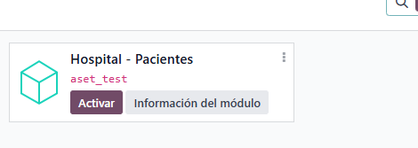
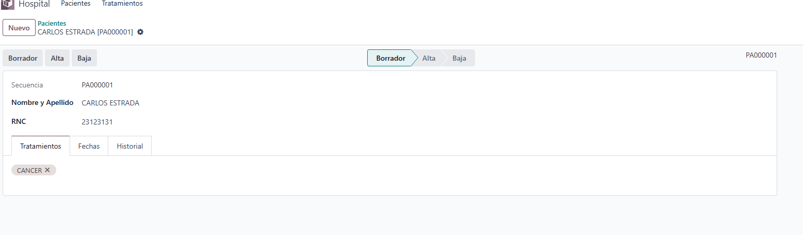
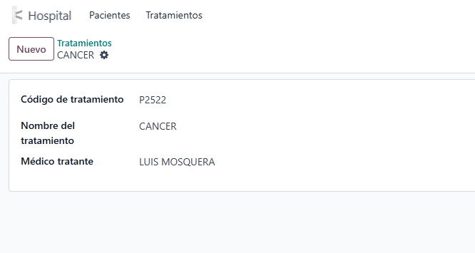
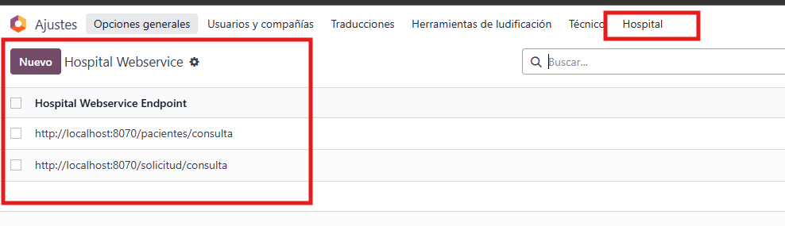
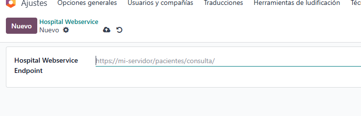
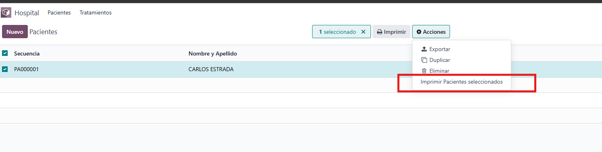
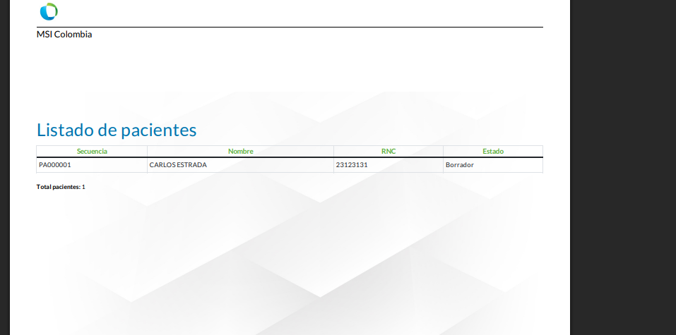
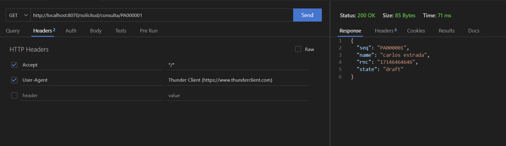

# Módulo Hospital — Documentación funcional

**Resumen corto**  
Módulo Odoo que permite:
- Registrar pacientes y asignarles tratamientos (catálogo).
- Exponer una **API pública** que devuelve datos de paciente por *secuencia* (ej: `PA000001`), únicamente si la URL solicitada coincide con un endpoint autorizado configurado en Ajustes.
- Administrar endpoints autorizados desde Ajustes (lista blanca).
- Generar reportes PDF (QWeb) desde la vista Tree de pacientes.

---

## Índice
1. Propósito
2. Instalación rápida
3. Modelos y campos (resumen funcional)
4. Vistas y UX
5. Flujo funcional completo
   - A. Gestión de Tratamientos
   - B. Crear y gestionar Pacientes
   - C. Flujo de Estado (Borrador / Alta / Baja)
   - D. Reportes (PDF)
   - E. API pública y validación de endpoints
6. Ejemplos de uso (curl / respuestas)

---

## 1. Propósito
Documentar el comportamiento funcional del módulo Hospital para que un analista o desarrollador comprenda cómo usarlo e integrarlo sin necesidad de leer el código.

---

## 2. Instalación rápida
1. Añadir el módulo al `addons_path`.
2. Actualizar la lista de aplicaciones e instalar el módulo desde Apps.
3. (Opcional) Crear secuencia `hospital.patient.seq` si no existe — el sistema genera `patient_code` automáticamente si no se provee.

**Imagen — Instalación / Apps**  

---

## 3. Modelos y campos (resumen funcional)

### `hospital.patient`
- **patient_code** (secuencia): identificador único publicado en API y mostrado en listas.
- **name**: Nombre y Apellido (obligatorio).
- **display_name**: `name [patient_code]` (cálculo para mejor lectura).
- **document_number** (RNC): se normaliza (quita espacios, `-`, `.`) y se valida (solo dígitos).
- **treatment_ids**: Many2many a `hospital.treatment` (tratamientos aplicados).
- **state**: selección `draft`, `alta`, `baja`. Statusbar en formulario.
- **fecha_hora_actualizacion**: timestamp último guardado.
- **fecha_hora_alta**: timestamp cuando se puso `alta`.

**Imagen — Estructura de modelo (conceptual)**  

### `hospital.treatment`
- **name**: nombre del tratamiento.
- **description**: texto descriptivo (opcional).

**Imagen — Modelo tratamiento (conceptual)**  

### `hospital.settings`
- **hospital_endpoint**: cadena con endpoint autorizado. Puede ser:
  - path relativo (`pacientes/consulta`)
  - o URL completa (`https://api.ejemplo.com/pacientes/consulta`)
- Nota: este modelo persistente permite **varios registros**; validación evita crear exactamente el mismo endpoint dos veces.

**Imagen — Lista de endpoints (tree)**  

---

## 4. Vistas y UX (qué ve el usuario)

### Pacientes
- **Tree (lista)**: columnas mínimas:
  - Secuencia (`patient_code`), Nombre (`name`), RNC (`document_number`), Estado (`state`).
- **Form**:
  - Encabezado: `display_name`.
  - Campos editables: `name`, `document_number`, `treatment_ids`.
  - Statusbar con botones: `Borrador`, `Alta`, `Baja` (cada botón actualiza `state`).
  - `patient_code` readonly si generado por secuencia.
  - Footer/Información: `fecha_hora_actualizacion`, `fecha_hora_alta`.
- **Acciones**:
  - Acción para generar reporte PDF de los seleccionados.
  - Botones rápidos para cambiar estado (implementados en modelo).

### Tratamientos
- **Tree**: lista de tratamientos con `name`.
- **Form**: editar `name`, `description`.

### Ajustes (Endpoints)
- Lista (Tree) de `hospital.settings`.
- Form para editar `hospital_endpoint`.
- Ubicación recomendada: Ajustes → Opciones generales (añadir entrada dentro del menú de Ajustes) o en Administración → *Hospital* (si quieres menú propio restringido).

**Imagen — Form endpoint**  

---

## 5. Flujo funcional completo

> Esta sección está pensada para que un analista o desarrollador nuevo entienda el comportamiento sin leer código.

### A. Gestión de Tratamientos (catálogo)
1. Ir a **Hospital → Tratamientos**.
2. Crear nuevo tratamiento con `name` y descripción.
3. Guardar.  

**Reglas:**
- Validar duplicados si es necesario (opcional).
- Los tratamientos se gestionan independientemente; no se crean automáticamente desde el paciente (para control).

---

### B. Crear y gestionar Pacientes
1. Ir a **Hospital → Pacientes → Crear**.
2. Rellenar `name` (obligatorio).
3. `document_number`: puedes introducir con guiones, espacios o puntos; el sistema lo normaliza al guardar.
4. Seleccionar `treatment_ids` desde el catálogo.
5. Opcional: dejar `patient_code` vacío para que el sistema lo genere por secuencia.
6. Guardar.

**Automatismos al guardar:**
- Si `patient_code` no existe, se genera con `ir.sequence` (`hospital.patient.seq`).
- `document_number` se normaliza y se valida: solo dígitos. Si inválido, se muestra `ValidationError`.
- Se actualiza `fecha_hora_actualizacion`.
- Si el estado cambió a `alta` y `fecha_hora_alta` está vacío, se rellena la fecha/hora actual.

**Búsqueda y consideraciones de mayúsculas/minúsculas**
- Para API y búsquedas, **recomendar normalizar `patient_code`** (p. ej. guardar en mayúsculas) o hacer búsquedas case-insensitive (`ilike`) en el controlador para evitar rechazos por diferencias de caso.

---

### C. Flujo de Estado (Borrador / Alta / Baja)
- Botones en el formulario permiten cambiar el estado.
- Al pulsar `Alta`:
  - Se cambia `state` a `alta`.
  - Si `fecha_hora_alta` está vacío, se graba fecha/hora.
- `Borrador` y `Baja` cambian solo el estado.
- Estos cambios quedan registrados si `tracking=True` (si se necesitó trazabilidad en chatter).

---

### D. Reportes (PDF)
- QWeb template usa `web.external_layout` para header/footer (logo y datos de la compañía).
- Desde la vista Tree del paciente: seleccionar registros → `Acción → Imprimir Pacientes seleccionados`.
- La acción invoca `report_action(records)` y descarga un PDF con los campos listados.
- **Cuidado**: la plantilla debe contener un `<main>` (usado internamente por Odoo). Si no existe, al renderizar puede producir `IndexError: list index out of range`.

**Imagen — Ejemplo de PDF generado**  

**Imagen — Reporte**  

---

### E. API pública y validación de endpoints
**Objetivo:** permitir que sistemas externos consulten un paciente por `secuencia` únicamente si la URL coincide con un endpoint autorizado.

**Configuración:**
- Añadir en Ajustes uno o varios registros `hospital.settings` con `hospital_endpoint`. Ejemplos válidos:
  - `pacientes/consulta`
  - `http://mi-dominio.com/pacientes/consulta`
  - `solicitantes/consulta`  

**Comportamiento del controlador:**
1. Recibe una petición `GET` a una ruta pública.
2. Normaliza la parte *path* de la petición y la compara con la lista de *paths* configurados (si la configuración es una URL completa sólo se usa su path).
3. Si no hay endpoints configurados → responde `503` `{ "error": "Endpoint no configurado en Ajustes (Hospital)." }`.
4. Si la petición no coincide con ninguno de los paths autorizados → responde `404` `{ "error": "Endpoint no autorizado para esta ruta." }`.
5. Si coincide, extrae la `secuencia` como el primer segmento después del path autorizado:
   - Ej: `/pacientes/consulta/PA000001` → `secuencia = PA000001`.
6. Si falta secuencia → `400` `{ "error": "Falta secuencia en la URL..." }`.
7. Busca `hospital.patient` por `patient_code`: si existe devuelve `200` con JSON (seq, name, rnc, state), si no existe devuelve `404`.

**Imagen — Ejemplo de request / response**  

---

**Ejemplo 1: petición válida**
